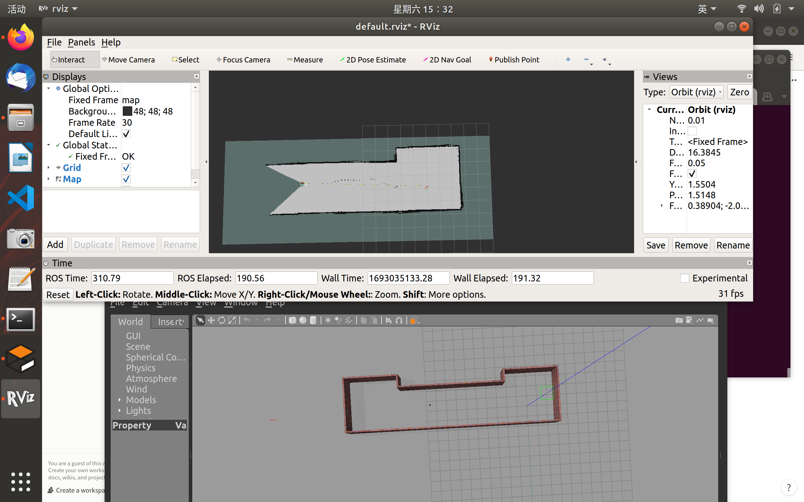

contibuter：jimazeyu cyj

# Introduction

这是一个机器人自动检测系统功能包，包含了建图，路径规划，定位，导航算法、并提供了常见的仿真环境及检测机器人模型。

该功能包可以实现陌生环境的自动化全流程检测过程，机器人进入陌生的环境进行主动SLAM探索建图。建图功能包括了2d、3d建图方式，可选择单机建图或多机器人协同建图方式。

在已经建好的图上，可以进行全局静态的路径规划，该路径规划也可以针对多机器人，进行任务区域划分与各区域的路径规划。（to do ：针对任务执行过程中的机器人数量变化以及局部地图的改变，将会有局部动态规划路径）

定位、导航模块，提供了主流的算法，可以与建图、路径规划模块兼容。

仿真环境主要包含简单小场景、复杂环境小场景、退化大场景（如长走廊）以及复杂大场景（往往需要多机协同建图）

# 2d_mapping

这是一个二维建图的模块，具体包括了单机建图，以及多机协同建图算法。

## single_2d_SLAM

单机的二维SLAM建图算法，其中包含了launch：集成多程序的启动文件；map：所建图存放位置；param：各节点参数设置；world：用以仿真建图的建模场景。

launch文件中的slam_method 提供了两种主流的算法框架，gmapping和cartographer。

### 运行方法

```bash
roslaunch single_2d_SLAM autonomous_mapping 
```

这样是默认采用gmapping算法，如果想要采用cartographer，则需要输入slam_method

```bash
roslaunch single_2d_SLAM autonomous_mapping roslam_method=cartographer
```

fig gmapping算法建图



## SMMR

 这个功能包可以实现多机协同主动探索SLAM，通过子图合并以及MMPF多目标人工势场法完成建图，具体请参考项目：SMMR-explore

fig1.三机器人建图前


fig2.三机器人建图，使用rrt算法（对照组）


fig3.三机器人建图，使用MMPF算法


# 3d_mapping

三维建图，待完善

# coverage_path_planning

覆盖路径规划，基于项目DARP

to do：实现更优的任务划分与动态局部路径规划

# detection_robots

主流机器人模型 主要应用：turtlebot3

# navigation

导航算法，基于已经建好的图或者规划好的路径进行导航

## track_navigation

循迹导航算法，在已经建立的栅格地图上创建蛇形路线图，并且将根据设定的机器人数量生成分区域多条路线图，机器人循迹遍历路线。

包含launch：集成启动各种所需文件；map：存放生成的地图信息（注意.yaml文件中需要修改对应的pgm文件路径；param：包含各种节点参数；paths：程序生成的每个机器人的路径信息；rviz：在riviz中显示路径的脚本；scripts：包含路径生成发布与路径显示程序

目前小bug：由于程序中调用了很多适配windows的opencv库，暂时无法在Linux下读图和识别。

### 运行方法：

```bash
roslaunch track_navigation multi_point_navigation.launch
```

track_navigation


# pure_localization

基于确定地图的localization

# virtual_scenarios

待完善：各种类型的world，供测试使用

https://b23.tv/EpNgbcV